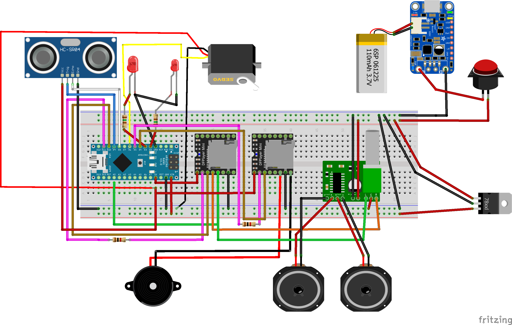

## Überschrift
### Schaltplan


Hier ist, wie du den C-Code in deiner Markdown-Datei einfügen kannst:

**File: c:\Users\linda\Documents\Arduino\DioramaWaldHuette\readme.md**

## Überschrift

```c
#include <stdio.h>

int main() {
    printf("Hello, World!\n");
    return 0;
}